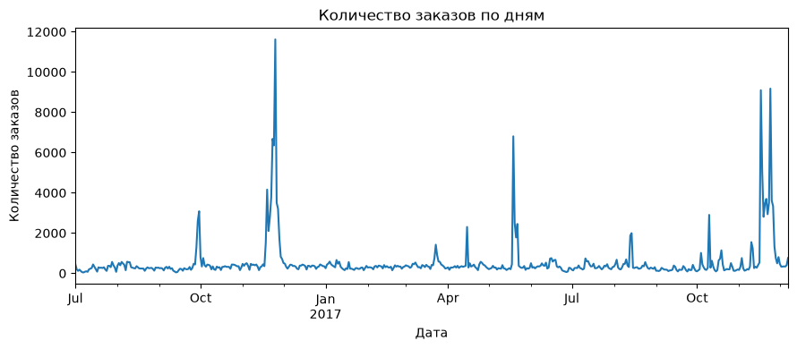

# ecommerce-orders-analysis

Исследование заказов электронной коммерции в Пакистане с марта 2016 по август 2018 года: техническая очистка, разведочный анализ,
сравнение бейзлайнов и прогноз **количества уникальных заказов в день** с помощью
`HistGradientBoostingRegressor`.

## Исследование

1. [Техническая проверка данных](notebooks/1.%20Техническая%20проверка%20данных.ipynb):
   очистка названий, пустых столбцов и строк, маркеров пропусков, чисел и дат.
2. [EDA](notebooks/2.%20EDA.ipynb): временное разбиение, пропуски, распределения,
   категории, способы оплаты, статусы и динамика заказов.
3. [Baseline](notebooks/3.%20Baseline.ipynb): значение в тот же день прошлого года
   и среднее дневное число заказов обучающего периода.
4. [Модель](notebooks/4.%20Модель.ipynb): пуассоновский градиентный бустинг и permutation importance.

Данные содержат 584 524 позиции и 408 782 уникальных заказа.

| Выборка | Период | Строк |
|---|---|---:|
| Train | 2016-07-01 - 2017-12-07 | 413 754 |
| Validation | 2017-12-08 - 2018-03-27 | 83 496 |
| Test | 2018-03-28 - 2018-08-28 | 87 274 |

Границы выбраны по накопленным 70% и 85% уникальных заказов. Заказы между
выборками не пересекаются. Подготовка данных воспроизводит размеры и даты ноутбука.

На train категория `Mobiles & Tablets` лидирует по сумме `qty_ordered` - 92 883
единицы; далее `Men's Fashion` - 79 713 и `Superstore` - 58 218.

Чаще всего в строках встречается оплата `cod` - 210 530 случаев.
Связь способа оплаты со статусом статистически значима, но слаба:
Cramér's V = 0,181.



## Модель и результаты исследования

Признаки: день недели, месяц, выходной, циклические недельные и годовые компоненты;
лаги 1/7/14/28 дней; среднее и стандартное отклонение за 7/28 предыдущих дней;
числовые дневные агрегаты, числа уникальных категориальных значений и число строк,
сдвинутые на один день.

Параметры: `loss="poisson"`, `learning_rate=0.03`, `max_iter=500`,
`max_leaf_nodes=15`, `min_samples_leaf=10`, `l2_regularization=5`, `random_state=42`.

| Метод | Выборка | MAE | RMSE | R² |
|---|---|---:|---:|---:|
| Тот же день прошлого года | Validation | 344,48 | 746,63 | −0,070 |
| Среднее train | Validation | 413,59 | 721,74 | около 0 |
| HistGradientBoostingRegressor | Validation | 330,74 | 693,25 | 0,077 |
| HistGradientBoostingRegressor | Test | 235,31 | 488,33 | 0,239 |

На validation бустинг улучшает показатели относительно обоих бейзлайнов,
но объясняет небольшую часть изменчивости ряда. По сохранённой таблице
permutation importance первые признаки - `raw_Customer ID_nunique`,
`raw_qty_ordered_std`, `raw_grand_total_max`, `lag_1` и `day_of_week`.

При повторном обучении и оценке **без фактических будущих агрегатов** получены:

| Выборка | MAE | RMSE | R² |
|---|---:|---:|---:|
| Validation | 393,21 | 713,93 | 0,021 |
| Test | 331,42 | 531,52 | 0,099 |

## Структура

```text
ecommerce-orders-analysis/
├── notebooks/                  # Ноутбуки
├── src/
│   ├── prepare_data.py         # Очистка и временное разбиение
│   ├── features.py             # Построение признаков
│   ├── train.py                # Обучение, сохранение и оценка
│   └── inference.py            # Загрузка и прогноз
│   └── model.joblib            # Модель, признаки, история и метаданные
├── data/
│   ├── raw/                    # Исходный test.csv
│   ├── processed/              # Четыре Parquet-файла
│   └── README.md
├── reports/
│   └── figures/                # 7 исходных графиков
├── tests/test_pipeline.py
├── requirements.txt
├── requirements-notebooks.txt
├── .gitignore
└── README.md
```

## Запуск

```bash
python -m venv .venv
```

Активация в PowerShell: `.venv\Scripts\Activate.ps1`;
в Linux/macOS: `source .venv/bin/activate`.

```bash
python -m pip install -r requirements.txt
```

```bash
python -m src.inference --days 7 --output reports/predictions/forecast.csv
```

По умолчанию прогноз начинается сразу после конца train - 2017-12-08.

```bash
python -m src.inference --history data/processed/cleaned_types.parquet --days 7
```

`--history` заменяет сохранённый контекст, но не переобучает модель.
Результат - CSV со столбцами `date` и `prediction`, в единицах заказов в день.
Прогноз не округляется до целого.

```python
from src.inference import forecast

predictions = forecast("models/model.joblib", days=7)
```

Для повторного обучения поместите исходный файл в `data/raw/test.csv`:

```bash
python -m src.prepare_data
python -m src.train --evaluate
```

```bash
python -m unittest discover -s tests -v
```
